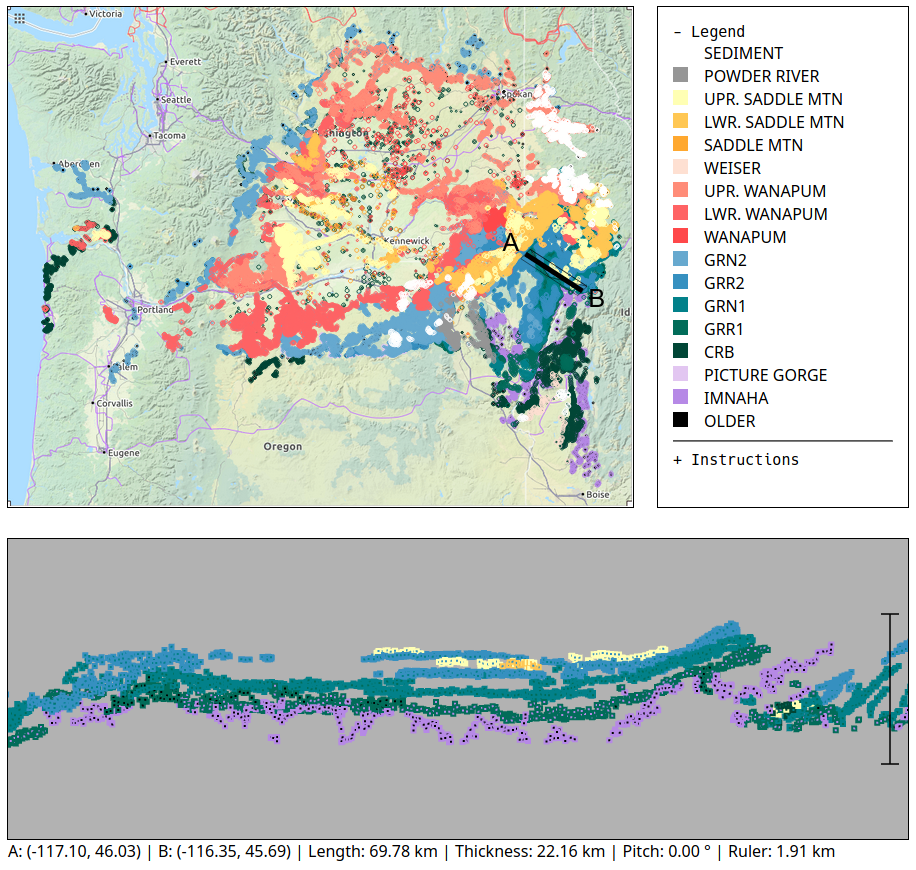

# CRB Explorer

An interactive webtool for visualizing geologic contacts between geologic units in the Columbia River Basalt Group.

This repository can be viewed as a web page via GitHub Pages: [https://jperryhouts.github.io/CRB-Explorer/](https://jperryhouts.github.io/CRB-Explorer/)

