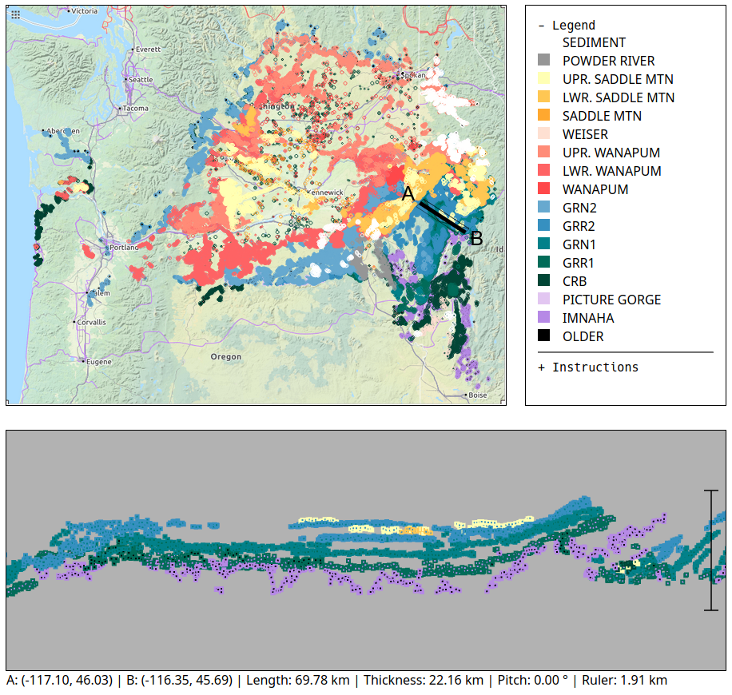

# Summary

Visualizing complex three-dimensional geologic structures is one of the most challenging core concepts in Earth Science curriculum.
An exceptionally useful way to communicate such complex structures is through interactive exploration, either in the form of hands-on activities using physical models or through digital visualizations.
Generic tools exist for digital exploration of 3D models and data, but learning to use them can be a barrier to access.
Purpose-built tools can offer a simplified entry point, but visualization software has traditionally been extremely complex, and custom software solutions for individual lessons would have been nearly impossible.
Modern web technologies enable rapid development of interactive software, facilitating development of hyper-specialized tools that reduce barriers to interacting with complex data or concepts.
[CRB Explorer](https://jperryhouts.github.io/CRB-Explorer/) is a purpose-built tool for visualizing a particular set of digitized geologic maps in both 2D and 3D.
It uses standards-compliant Javascript with no third-party libraries, and its code base demonstrates patterns and methods for developing complex application-specific educational tools.

# Statement of Need

Interactive digital tools are increasingly common in STEM education, but the availability of such tools is frequently limited to on-campus workstations with specialized software preinstalled and centrally maintained.
In many cases these tools are available for students to download and install on their own computers, but some students may be restricted by compatibility or performance limitations of their personal devices.
This can create an accessibility barrier, by presenting unequal obstacles for students who rely on campus resources in order to access necessary materials.
It also imposes a logistical and financial burden on universities to maintain and support sufficient shared workstations.
Additionally, with the recent transition to remote learning, software accessibility has become a more urgent issue, as access to on-campus facilities may not be possible for some students.

Web browsers provide a standardized cross-platform environment that is optimized for rapid development of rich interactive user interfaces.
Several examples of educational tools for life sciences have been released and distributed through custom web interfaces [@Fisher2019; @Scotti2020].
Recent adoption of WebGL standards [@webGL] in all modern browsers pushes these capabilities even further, enabling access to complex and potentially computationally-intensive software from any modern internet-connected device.
By providing access to low-level system resources, WebGL opens the door to development of interactive 3D visualizations and parallel computations with relatively modest hardware requirements, and nearly universal device compatibility.

`CRB Explorer` benefits from its "stateless" nature, executing completely within the user's browser with no server or database back-end, making deployment simple and free of charge via static hosting services like [GitHub Pages](https://pages.github.com/).
However, the same principles of accessibility apply to more complex software, and server-backed tools like JupyterHub [@JupyterHub] have potential for reaching students with limited access to computational resources.
By lowering the barriers to entry, web applications have the potential to expand access to specialized tools, allowing students to fully participate in their education.

# Acknowledgments
The data set bundled with `CRB Explorer` was generated in collaboration with Gene Humphreys, Daniel O'Hara, Ana Mercedes Col&oacute;n, and Nate Klema. It consists of digitized geologic contacts from publications of the United States Geological Survey and the Idaho Geological Survey. Specific map citations are included in the `CRB Explorer` online interface.

The bundled base map image was generated by [OpenStreetMap.org](https://www.openstreetmap.org/export#map=7/46.054/-120.004&layers=C), and is made available under the [Open Data Commons Open Database License (ODbL)](https://opendatacommons.org/licenses/odbl/) by the [OpenStreetMap Foundation (OSMF)](https://osmfoundation.org/).

# License
 This work is licensed under a <a rel="license" href="http://creativecommons.org/licenses/by/4.0/">Creative Commons Attribution 4.0 International License</a>.

# References
